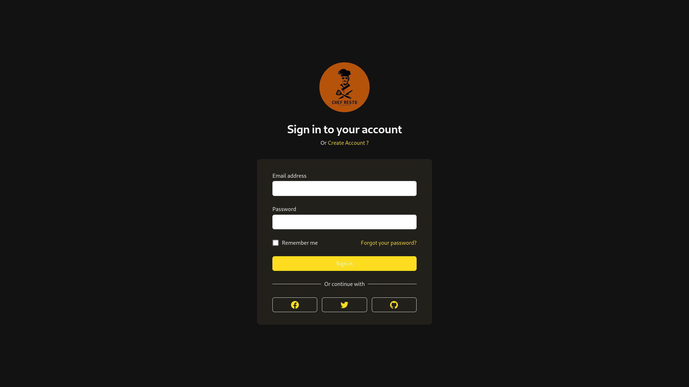
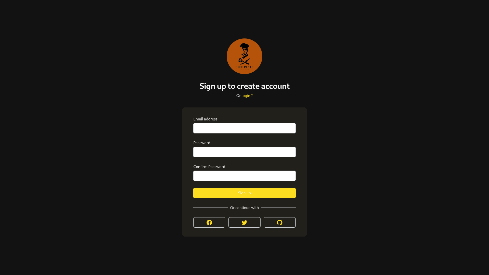
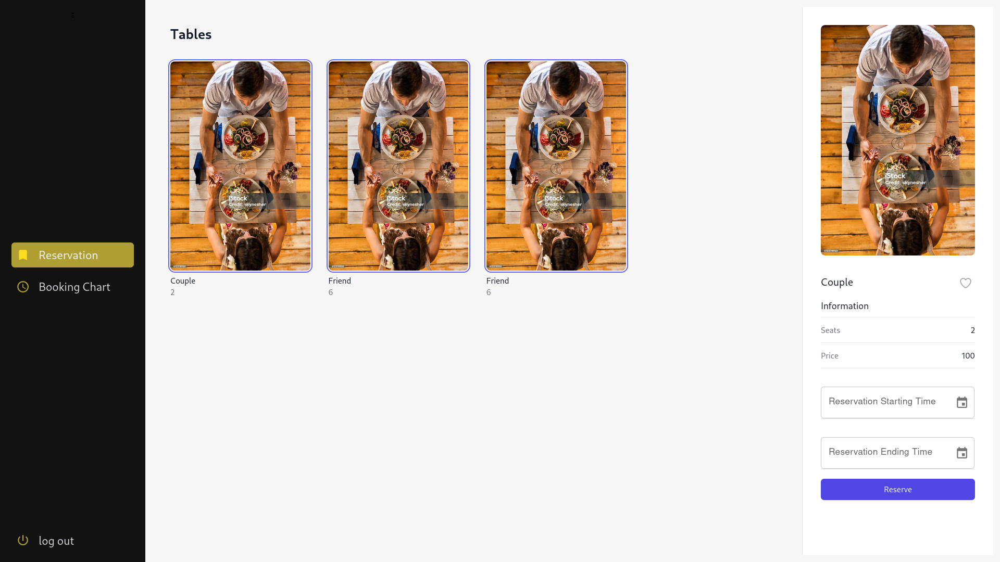
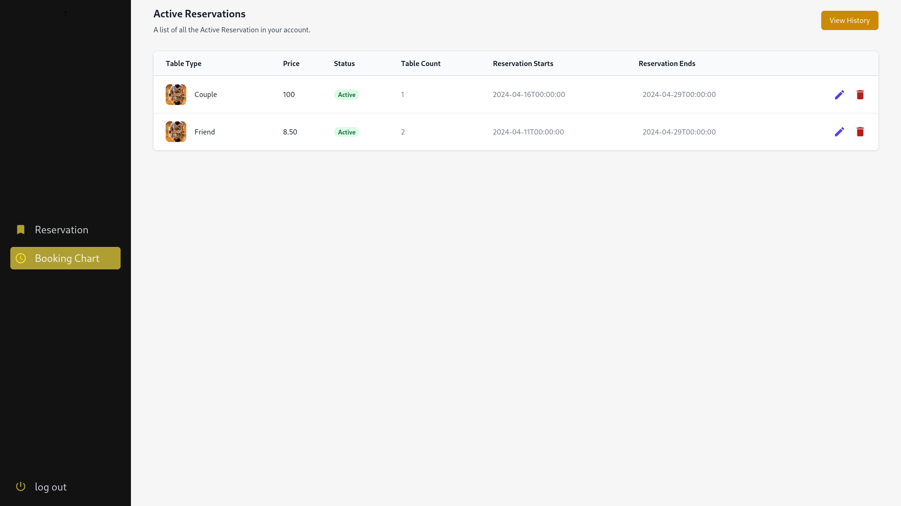
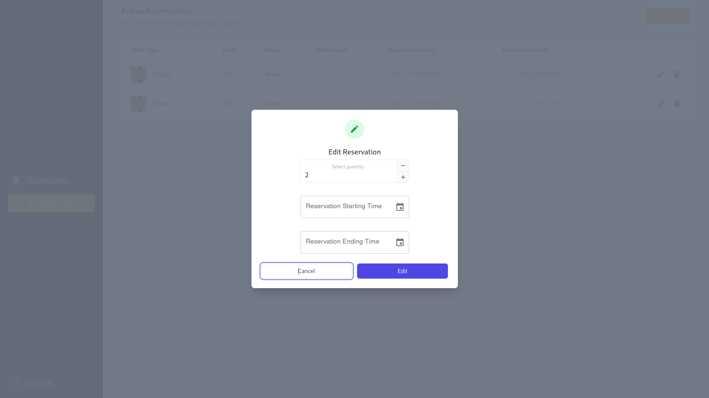
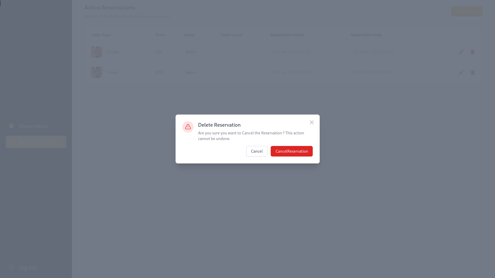

# Butchers Garden Table Reservation System Documentation

## Overview

Butchers Garden is a table reservation system designed to simplify the process of managing table reservations, creating and modifying tables, and handling user authentication via JWT. This documentation provides an overview of the available endpoints and their basic usage.

### Login


### SignUp


### Reserve Table and AvailableTables


### Reserve Table and AvailableTables


### Edit Reservation


### Delete Reservation



## Table of Contents

- [Reservation Routes](#reservation-routes)
  - [Get Available Tables](#get-available-tables)
  - [Get Reserved Tables](#get-reserved-tables)
  - [Reserve a Table](#reserve-a-table)
  - [Edit Reservation](#edit-reservation)
  - [Cancel Reservation](#cancel-reservation)
- [Table Management Routes](#table-management-routes)
  - [Create Table](#create-table)
  - [Get Table](#get-table)
  - [Get All Tables](#get-all-tables)
  - [Edit Table](#edit-table)
  - [Delete Table](#delete-table)
- [Authentication Routes](#authentication-routes)
  - [Register](#register)
  - [Account Activation](#account-activation)
  - [Login](#login)
- [Conclusion](#conclusion)

## Reservation Routes

### Get Available Tables

- **Endpoint:** `/reservation/availableTables`
- **Method:** GET
- **Description:** Fetches a list of available tables for reservation.
- **Response:**
    ```json
    {
      "status": "success",
      "data": [...]
    }
    ```

### Get Reserved Tables

- **Endpoint:** `/reservation/reservedTables`
- **Method:** GET
- **Headers:**
  - `Authorization: Bearer token`
- **Description:** Fetches a list of reserved tables for the authenticated user.
- **Response:**
    ```json
    {
      "status": "success",
      "data": [...]
    }
    ```

### Reserve a Table

- **Endpoint:** `/reservation/reserveTable`
- **Method:** POST
- **Headers:**
  - `Authorization: Bearer token`
- **Request Body:**
    ```json
  {
      "tableId": 1,
      "count": 2,
      "price": "some price",
      "bookingStarts": "2024-04-22 00:00:00",
      "bookingEnd": "2024-04-22 00:00:00"
  }
    ```
- **Description:** Reserves a table for the authenticated user.
- **Response:**
    ```json
    {
      "status": "success",
      "data": {...}
    }
    ```

### Edit Reservation

- **Endpoint:** `/reservation/editReservation`
- **Method:** PUT
- **Headers:**
  - `Authorization: Bearer token`
- **Request Body:**
    ```json
   {
      "reservationId": 174,
      "count": 3,
      "tableId": 1,
      "editEnd": "2024-04-23 00:00:00",
      "editStart": "2024-04-23 00:00:00"
  }
    ```
- **Description:** Edits an existing reservation for the authenticated user.
- **Response:**
    ```json
    {
      "status": "success",
      "data": {...}
    }
    ```

### Cancel Reservation

- **Endpoint:** `/reservation/cancelReservation`
- **Method:** DELETE
- **Request Param:**
  - `reservationId`: ID of the reservation to cancel
- **Description:** Cancels a reservation.
- **Response:**
    ```json
    {
      "status": "success",
      "data": {...}
    }
    ```

## Table Management Routes

### Create Table

- **Endpoint:** `/table/createTable`
- **Method:** POST
- **Request Body:**
    ```json
   [
      {
        "isAc": true,
        "tableTypeId": 2,
        "tablePrice": "8.50",
        "tableCount": 3
      }
  ]
    ```
- **Description:** Creates new tables.
- **Response:**
    ```json
    {
      "status": "success",
      "data": {...}
    }
    ```

### Get Table

- **Endpoint:** `/table/getTable`
- **Method:** POST
- **Request Body:**
    ```json
    [
      1, 2, 3
    ]
    ```
- **Description:** Retrieves details of specific tables.
- **Response:**
    ```json
    {
      "status": "success",
      "data": [...]
    }
    ```

### Get All Tables

- **Endpoint:** `/table/getAllTable`
- **Method:** GET
- **Description:** Retrieves details of all tables.
- **Response:**
    ```json
    {
      "status": "success",
      "data": [...]
    }
    ```

### Edit Table

- **Endpoint:** `/table/editTable`
- **Method:** POST
- **Request Body:**
    ```json
    [
        {
          "tableId": 1,
          "newTableNumber": 10,
          "newSeats": 6
        },
      ...
    ]
    ```
- **Description:** Edits details of existing tables.
- **Response:**
    ```json
    {
      "status": "success",
      "data": {...}
    }
    ```

### Delete Table

- **Endpoint:** `/table/deleteTable`
- **Method:** DELETE
- **Description:** Deletes a table.
- **Response:**
    ```json
    {
      "status": "success",
      "data": {...}
    }
    ```

## Authentication Routes

### Register

- **Endpoint:** `/auth/register`
- **Method:** POST
- **Request Body:**
    ```json
    {
      "username": "john_doe",
      "password": "password123"
    }
    ```
- **Description:** Registers a new user.
- **Response:**
    ```json
    {
      "status": "success",
      "data": {...}
    }
    ```

### Account Activation

- **Endpoint:** `/auth/accountActivation`
- **Method:** GET
- **Request Param:**
  - `token`: Activation token
- **Description:** Activates a user account.
- **Response:**
    ```json
    {
      "status": "success",
      "data": {...}
    }
    ```

### Login

- **Endpoint:** `/auth/login`
- **Method:** POST
- **Request Body:**
    ```json
    {
      "username": "john_doe",
      "password": "password123"
    }
    ```
- **Description:** Authenticates a user and returns a JWT.
- **Response:**
    ```json
    {
      "status": "success",
      "data": {
        "token": "..."
      }
    }
    ```

## Conclusion

This documentation provides a basic understanding of the endpoints and their usage in the Table Reservation System. For further details, please refer to the code implementation or contact the development team.
